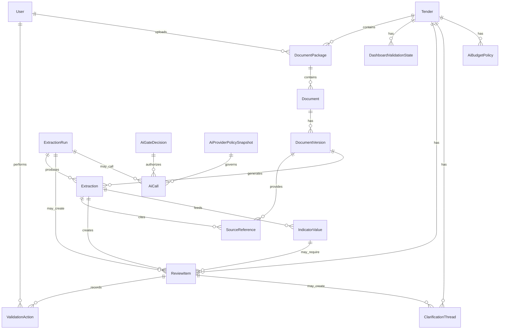

# TRAM V1 - Data model minimo

Data: 2026-05-12
Stato: proposta concettuale per MVP, non schema database definitivo
Ambito: Tender, documenti, estrazioni, validazione, dashboard

## Scopo

Questo documento definisce il data model minimo di TRAM V1.

Il modello serve a sostenere quattro esigenze:

- conservare pacchetti e documenti di gara in modo ordinato;
- estrarre dati strutturati con fonti verificabili;
- distinguere dato proposto, dato validato e dato superato;
- alimentare dashboard, review queue, contraddizioni e chiarimenti/Q&A.

## Principio guida

La V1 deve essere **evidence-first**.

Ogni dato importante deve rispondere a queste domande:

- da quale documento arriva?
- da quale versione?
- da quale pagina, sezione, tabella, cella o estratto?
- è stato estratto da parser, regola o AI?
- con quale confidenza?
- è stato validato da un utente?
- è ancora corrente o è stato superato?

Senza questa tracciabilità TRAM rischia di diventare una chat sui documenti. Con questa tracciabilità può diventare una mappa affidabile della gara.

## Mappa concettuale

## Entità core

### Tender

Rappresenta una gara/spazio.

Campi minimi:

| Campo | Tipo concettuale | Note |
| --- | --- | --- |
| `id` | UUID | Identificativo stabile |
| `name` | text | Nome Tender |
| `codename` | text | Eventuale nome interno |
| `authority_name` | text | Stazione appaltante o contracting entity |
| `country` | text | Paese |
| `mode` | enum | metro, tram, light rail, bus, ferry, rail, mixed, altro |
| `o_and_m_scope` | text | Sintesi perimetro |
| `procurement_stage` | enum | Fase complessiva dello spazio: prequalifica, ITT, ITN, negoziazione, addendum, award, altro |
| `procedure_type` | enum | aperta, ristretta, negoziata, dialogo competitivo, non chiara |
| `status` | enum | active, archived, paused |
| `created_at` | datetime | Audit |
| `updated_at` | datetime | Audit |

Relazioni:

- contiene più `DocumentPackage`;
- ha più `ReviewItem`;
- ha una o più viste `DashboardValidationState`;
- può avere più `ClarificationThread`.

### DocumentPackage

Rappresenta un pacchetto caricato dentro un Tender.

Esempi: Copenhagen M1-M4 O&M, Dublin Luas O&M.

Campi minimi:

| Campo | Tipo concettuale | Note |
| --- | --- | --- |
| `id` | UUID | Identificativo |
| `tender_tender_id` | FK | Spazio |
| `name` | text | Nome pacchetto |
| `package_type` | enum | prequalifica, ITT, ITN, addendum, clarification, mixed, unknown |
| `package_phase` | enum | prequalification_package, itt_package, itn_package, negotiation_package, revised_tender_package, bafo_package, addendum_package, clarification_package, unknown |
| `source_label` | text | Nome sorgente o cartella |
| `local_path` | text | Solo in ambiente locale/dev |
| `uploaded_by` | FK User | Utente |
| `uploaded_at` | datetime | Audit |
| `status` | enum | imported, processing, processed, needs_review, archived |
| `notes` | text | Annotazioni |

Relazioni:

- contiene più `Document`;
- eredita o propone una fase procurement.

### Document

Rappresenta il documento logico, non solo il file.

Esempio: “Instructions to Tender” è un `Document`; v3, v4 e v5 sono `DocumentVersion`.

Campi minimi:

| Campo | Tipo concettuale | Note |
| --- | --- | --- |
| `id` | UUID | Identificativo |
| `document_package_id` | FK | Pacchetto |
| `title` | text | Titolo normalizzato |
| `document_nature` | enum | Natura funzionale: tender_instructions, version_comparison, procurement_schedule, submission_template, pricing_workbook, contract_conditions, contract_definitions, contract_specification, payment_terms, clarification, addendum, VDR, other |
| `document_role` | enum | Ruolo specifico del file: instructions_to_tender, track_changes_version, form_of_tender, schedule_of_prices, conditions_of_contract, definitions_and_abbreviations, contract_specifications, payment_attachment, procurement_schedule, altro |
| `package_phase_inherited` | enum/null | Fase del pacchetto, se serve denormalizzata per chiarimenti e dashboard |
| `procurement_stage` | enum/null | Campo da evitare come classificazione unica del documento; mantenerlo solo come alias temporaneo se serve migrazione o import legacy |
| `is_mandatory` | boolean/null | Se noto |
| `status` | enum | current, superseded, informational, duplicate, unknown |
| `created_at` | datetime | Audit |
| `updated_at` | datetime | Audit |

Relazioni:

- ha più `DocumentVersion`;
- può essere richiamato da molte `SourceReference`.

Nota di modellazione:

- `package_phase` descrive la fase del pacchetto in cui il documento è stato fornito;
- `document_nature` descrive la natura funzionale o contrattuale del documento;
- `document_role` descrive il ruolo specifico del file dentro quella natura;
- lo stato corrente o superato va gestito su `Document`/`DocumentVersion`, non dedotto da `procurement_stage`.

Decisione da benchmark T1 L0 v0.2: un documento contrattuale dentro un pacchetto ITT non deve essere classificato come documento “ITT” solo perché si trova nel pacchetto ITT. Esempio: un allegato sui pagamenti incluso nell’ITT avrà `package_phase = itt_package`, `document_nature = payment_terms` e `document_role = payment_attachment`.

### DocumentVersion

Rappresenta un file specifico o una versione specifica del documento.

Campi minimi:

| Campo | Tipo concettuale | Note |
| --- | --- | --- |
| `id` | UUID | Identificativo |
| `document_id` | FK | Documento logico |
| `file_name` | text | Nome file originale |
| `file_path` | text | Path storage o locale |
| `file_type` | enum | PDF, DOCX, XLSX, XLS, MPP, ZIP, altro |
| `mime_type` | text | Tecnico |
| `file_size_bytes` | integer | Tecnico |
| `hash` | text | Deduplica e audit |
| `document_id_external` | text | ID documento da gara, se presente |
| `version_label` | text | v1, v2.0, 4.0, ecc. |
| `issue_date` | date/null | Data documento |
| `is_track_changes` | boolean | Versione con modifiche |
| `clean_version_id` | FK/null | Collegamento alla versione pulita |
| `supersedes_version_id` | FK/null | Versione superata |
| `document_family_key` | text/null | Chiave resolver per raggruppare versioni concorrenti |
| `variant_type` | enum/null | clean, track_changes, redline, commented, appendix, pricing_workbook, unknown |
| `version_sort_key` | number/null | Valore comparabile usato dal resolver |
| `currentness_rule_candidate` | enum/null | current_candidate, not_current_candidate, unknown, needs_review |
| `currentness_reason` | text/null | Motivo auditabile della proposta rule-based |
| `resolver_version` | text/null | Versione del resolver che ha prodotto il dato |
| `page_count` | integer/null | Se applicabile |
| `text_extraction_status` | enum | not_started, extracted, ocr_required, failed, partial |
| `status` | enum | current, superseded, duplicate, needs_review, unknown |

Relazioni:

- genera `Extraction`;
- offre `SourceReference`.

Decisione da benchmark T1 L0 v0.3 hybrid: `version` e `currentness` non devono essere consolidati da output AI puro. Il campo corrente deve derivare dal resolver deterministico documentato in `/Users/Matteo/Documents/TRAM/docs/planning/tram-v1-document-family-version-currentness-resolver-v0-1.md`, con review queue sui casi non deterministici.

### ExtractionRun

Rappresenta una singola esecuzione della pipeline.

Serve per capire quando e come un dato è stato prodotto.

Campi minimi:

| Campo | Tipo concettuale | Note |
| --- | --- | --- |
| `id` | UUID | Identificativo |
| `tender_tender_id` | FK | Spazio |
| `run_type` | enum | ingest, parse, ai_extract, reconcile, refresh, manual |
| `triggered_by` | enum | user, system, scheduled |
| `model_or_tool` | text | Es. Poppler, MPXJ, OCRmyPDF, modello AI |
| `prompt_version` | text/null | Se AI |
| `started_at` | datetime | Audit |
| `completed_at` | datetime/null | Audit |
| `status` | enum | running, completed, failed, partial |
| `error_summary` | text/null | Se fallisce |

Relazioni:

- produce molte `Extraction`;
- può creare `ReviewItem`.

### AiGateDecision

Rappresenta la decisione pre-flight prima di inviare contenuto a un modello AI.

Serve a separare la domanda “posso fare questa chiamata?” dalla chiamata effettiva.

Campi minimi:

| Campo | Tipo concettuale | Note |
| --- | --- | --- |
| `id` | UUID | Identificativo |
| `tender_tender_id` | FK | Spazio gara |
| `document_package_id` | FK/null | Pacchetto coinvolto |
| `document_version_id` | FK/null | Documento coinvolto |
| `task_id` | text | Task o benchmark |
| `task_category` | enum | classification, extraction, reconciliation, contradiction, clarification, summary |
| `requested_privacy_level` | enum | L0, L1, L2 |
| `effective_privacy_level` | enum | Livello dopo classificazione input |
| `content_classes` | JSON/list | Classi `dc_*` definite nella matrice provider |
| `provider_candidate` | text | Provider candidato |
| `model_candidate` | text | Modello candidato |
| `policy_status` | enum | allowed, blocked, requires_human_approval, requires_policy_review, requires_cost_review |
| `clause_scan_status` | enum | not_needed, not_started, no_blocker_found, blocker_found, unclear |
| `cost_gate_status` | enum | allowed_free, blocked_budget, blocked_quota, unknown_usage_requires_review |
| `human_approval_required` | boolean | Se serve consenso utente |
| `created_at` | datetime | Audit |

### AiCall

Rappresenta una singola chiamata a provider AI o modello self-hosted.

Non sostituisce `ExtractionRun`: una run può generare molte chiamate AI, mentre una chiamata AI è un evento tecnico auditabile.

Campi minimi:

| Campo | Tipo concettuale | Note |
| --- | --- | --- |
| `id` | UUID | Identificativo |
| `tender_tender_id` | FK | Spazio gara |
| `extraction_run_id` | FK/null | Run collegata |
| `gate_decision_id` | FK | Gate che autorizza o blocca |
| `provider_policy_snapshot_id` | FK | Policy provider consultata |
| `provider` | enum/text | Gemini, Mistral, Cloudflare, Groq, Cerebras, OpenRouter, self_hosted |
| `model` | text | Nome modello esatto |
| `endpoint_family` | enum | chat, structured_output, embeddings, OCR, rerank, altro |
| `account_tier` | enum | free, experiment, paid_capped, enterprise, self_hosted |
| `billing_mode` | enum | free_quota, credit, capped_paid, self_hosted_compute |
| `prompt_pack_id` | text | Pack usato |
| `prompt_version` | text | Versione prompt |
| `schema_version` | text | Versione schema |
| `input_hash` | text | Hash input inviato |
| `output_hash` | text | Hash output ricevuto |
| `provider_usage_json` | JSON | Usage normalizzato, senza contenuti |
| `estimated_cost_amount` | number | Default V1: 0 |
| `estimated_cost_currency` | text/null | Valuta o n/a |
| `quota_observability` | enum | available, unavailable, delayed, manual |
| `source_reference_ids` | JSON/list | Fonti usate per comporre input |
| `redaction_policy_id` | text/null | Policy applicata |
| `minimization_summary` | JSON/text | Cosa è stato incluso/escluso e perché |
| `status` | enum | planned, queued, running, completed, completed_with_warnings, failed, suspended_quota, suspended_budget, blocked_policy, blocked_privacy, blocked_clauses |
| `error_class` | text/null | Se fallisce |
| `error_message_redacted` | text/null | Senza contenuti riservati |
| `started_at` | datetime | Audit |
| `completed_at` | datetime/null | Audit |
| `latency_ms` | integer/null | Latenza |

### AiProviderPolicySnapshot

Fotografa la policy provider usata quando TRAM decide o fa una chiamata.

Campi minimi:

- `id`;
- `provider`;
- `policy_checked_at`;
- `policy_source_urls`;
- `training_use_status`: yes_by_default, no_by_default, opt_out_available, unclear;
- `retention_status`: none_claimed, limited, abuse_monitoring, unclear;
- `data_region_status`: eu, global, us, configurable, unclear;
- `dpa_status`: available, unavailable, not_checked, not_applicable;
- `allowed_privacy_levels`;
- `review_before_next_l1_l2`.

### AiBudgetPolicy

Definisce limiti gratuiti e blocchi di costo.

Campi minimi:

- `id`;
- `tender_tender_id`;
- `provider`;
- `max_cost_per_call`;
- `max_cost_per_day`;
- `allow_paid_fallback`, default `false`;
- `require_manual_approval_above`;
- `quota_check_required`;
- `unknown_usage_policy`: suspend_batch, allow_single_test, block.

Documento di dettaglio:

- `/Users/Matteo/Documents/TRAM/docs/planning/tram-v1-ai-call-registry-and-gates-v0-1.md`
- `/Users/Matteo/Documents/TRAM/docs/planning/tram-v1-ai-document-class-provider-matrix-v0-1.md`
- `/Users/Matteo/Documents/TRAM/docs/planning/tram-v1-ai-chunk-minimization-redaction-policy-v0-1.md`

### Extraction

Rappresenta un output strutturato proposto dal sistema.

Non è automaticamente “dato vero”.

Campi minimi:

| Campo | Tipo concettuale | Note |
| --- | --- | --- |
| `id` | UUID | Identificativo |
| `tender_tender_id` | FK | Spazio |
| `document_version_id` | FK/null | Fonte principale |
| `extraction_run_id` | FK | Run |
| `extraction_type` | enum | network, timeline, requirement, definition, deliverable, KPI, financial, financial_item, cost_driver, contradiction, clarification_seed, document_role, compliance |
| `raw_value` | JSON/text | Valore originario |
| `normalized_value` | JSON/text | Valore normalizzato |
| `confidence` | enum/number | Alta, media, bassa o score |
| `automation_source` | enum | deterministic, rule_based, ai_extraction, ai_reasoning, manual |
| `status` | enum | extracted, proposed, confirmed, corrected, contested, unclear, superseded, not_applicable |
| `created_at` | datetime | Audit |
| `updated_at` | datetime | Audit |

Relazioni:

- cita una o più `SourceReference`;
- può alimentare uno o più `IndicatorValue`;
- può generare uno o più `ReviewItem`.

### SourceReference

Rappresenta la prova collegata a un dato.

Campi minimi:

| Campo | Tipo concettuale | Note |
| --- | --- | --- |
| `id` | UUID | Identificativo |
| `document_version_id` | FK | Versione documento |
| `page_number` | integer/null | PDF o render |
| `section_label` | text/null | Clausola, heading, tab |
| `table_label` | text/null | Se tabella |
| `cell_reference` | text/null | Se Excel |
| `text_excerpt` | text | Estratto breve |
| `bbox` | JSON/null | Coordinate future per visual highlight |
| `source_type` | enum | text, table, cell, metadata, web, manual |
| `url` | text/null | Per fonti web |

Relazioni:

- supporta `Extraction`, `IndicatorValue`, `ReviewItem` e `ClarificationThread`.

### IndicatorValue

Rappresenta un dato normalizzato da mostrare in dashboard o griglie.

Esempi: “44 stazioni”, “Service Availability”, “contract signing 2026-09-25”, “Quality 60%”.

Il registro operativo degli `indicator_key` P0/P1 è in `/Users/Matteo/Documents/TRAM/docs/planning/tram-v1-indicator-key-registry-p0-p1-v0-1.md`.

Campi minimi:

| Campo | Tipo concettuale | Note |
| --- | --- | --- |
| `id` | UUID | Identificativo |
| `tender_tender_id` | FK | Spazio |
| `indicator_family` | enum | identity, procurement, contract, network, financial, KPI, maintenance, operations, customer, workforce, compliance, risk, versioning, data_quality |
| `indicator_key` | text | Nome stabile, es. `contract.start_of_operation` |
| `label` | text | Nome leggibile |
| `value` | JSON/text | Valore |
| `unit` | text/null | km, EUR, giorni, %, ecc. |
| `source_extraction_id` | FK/null | Estrazione che lo alimenta |
| `status` | enum | proposed, confirmed, corrected, contested, unclear, superseded |
| `risk_class` | enum | critical, high, medium, low |
| `is_dashboard_p0` | boolean | Se entra nel primo livello dashboard |
| `updated_at` | datetime | Audit |

Relazioni:

- può richiedere `ReviewItem`;
- alimenta `DashboardValidationState`.

## Entità specialistiche V1

Queste entità possono essere viste dedicate sopra `Extraction`/`IndicatorValue`, oppure tabelle vere se lo sviluppo lo richiede.

### Requirement

Campi minimi:

- `id`;
- `tender_tender_id`;
- `requirement_id`;
- `requirement_type`: MR, general, obligation, information, evaluation_factor;
- `text_raw`;
- `text_short`;
- `cluster`: operation, maintenance, mobilisation, reporting, compliance, financial, workforce, customer, safety_security, sustainability, altro;
- `o_and_m_domain`;
- `mandatory_candidate`;
- `impact_tags`: cost, risk, deliverable, compliance, timeline, KPI, financial_escalation;
- `linked_deliverable_ids`;
- `source_reference_ids`;
- `ai_call_id`;
- `extraction_id`;
- `status`;
- `review_item_id`.

### KPI

Campi minimi:

- `id`;
- `tender_tender_id`;
- `kpi_id`;
- `name`;
- `family`;
- `formula_raw`;
- `target_raw`;
- `threshold_raw`;
- `measurement_period`;
- `data_source`;
- `exclusions`;
- `bonus_malus_link`;
- `linked_requirement_ids`;
- `financial_link_status`: none, possible, confirmed, unknown;
- `source_reference_ids`;
- `ai_call_id`;
- `extraction_id`;
- `status`.

Decisione da tassonomia T4: requisiti e KPI non finanziari restano nello stesso task perché nel dominio O&M sono spesso collegati. Formula, target, soglie e obbligatorietà non devono essere alterati dall’AI; KPI con bonus/malus, payment, deductions o penali scala a T5 e review obbligatoria, ma non a L2 per categoria.

### TimelineEvent

Campo specialistico per T2 timeline.

Regola: date, orari, durate, timezone, conflitti e stato review derivano da parser/regole deterministiche. L’AI può contribuire a nome normalizzato, categoria semantica e incertezze, ma non è fonte unica del valore temporale.

Campi minimi:

- `id`;
- `tender_tender_id`;
- `event_name_raw`;
- `event_name_normalized`;
- `timeline_type`: procurement, contract, mobilisation, service_timetable, clarification_update, relative_dialogue_sequence, unknown;
- `event_type`: milestone, period, deadline, meeting, standstill, document_issue, service_commencement, financial_close, contradiction_candidate, relative_sequence, missing_evidence, unknown;
- `date_start`;
- `date_end`;
- `time_start`;
- `time_end`;
- `timezone`;
- `date_precision`: minute, day, week, month, quarter, year, relative, conflict, unknown;
- `duration_value`;
- `duration_unit`;
- `anchor_event`;
- `criticality`;
- `review_required`;
- `source_reference_ids`;
- `ai_call_id`;
- `extraction_id`;
- `status`.

Se `date_precision=conflict`, l’evento deve generare un `ReviewItem` e, se utile, un `ContradictionCandidate`.

### TenderDeliverable

Campi minimi:

- `id`;
- `tender_tender_id`;
- `document_package_id`;
- `deliverable_id`;
- `code`;
- `name_raw`;
- `name_normalized`;
- `description`;
- `deliverable_type`;
- `submission_area`: administrative, technical, economic, financial, pqq_qualification, pqq_technical, compliance, altro;
- `o_and_m_domain`: transition, operations, maintenance, safety_security, sustainability_environment, workforce, pricing_financial, compliance, procurement_admin, project_finance, reference_projects, altro;
- `mandatory`;
- `evaluation_weight`;
- `page_limit`;
- `format_requirement`;
- `deadline_ref`;
- `dependencies`;
- `criticality`;
- `review_required`;
- `source_reference_ids`;
- `ai_call_id`;
- `extraction_id`;
- `status`.

Decisione da benchmark T3 deliverable v0.1: `code`, `mandatory`, `evaluation_weight`, `page_limit`, `format_requirement`, `deadline_ref`, valori economici e checklist finale non devono essere consolidati da output AI puro. Questi campi derivano da parser, tabelle, regole e validazione umana. L’AI può proporre solo `name_normalized`, `deliverable_type`, `submission_area`, `o_and_m_domain`, `dependencies`, `uncertainties` e, come hint non definitivo, `criticality`.

### FinancialItem

Campo specialistico per T5 financials, pricing e payment mechanism.

Regola: T5 è `L2_sensitive` di default. Provider AI esterni non sono route default V1. I valori, le formule e i collegamenti economici derivano da parser locali, source refs e review umana.

Campi minimi:

- `id`;
- `tender_tender_id`;
- `financial_item_id`;
- `financial_class`: pricing_workbook, financial_model, payment_mechanism, guarantee, penalty, indexation, energy_cost, insurance, tax, other;
- `source_document_id`;
- `source_sheet_or_section`;
- `cell_reference`;
- `value_raw`;
- `unit_or_currency`;
- `formula_raw`;
- `payment_mechanism_component`;
- `risk_allocation`;
- `linked_requirement_ids`;
- `linked_deliverable_ids`;
- `privacy_level`;
- `review_required`;
- `source_reference_ids`;
- `extraction_id`;
- `status`.

### CostDriver

Campi minimi:

- `id`;
- `tender_tender_id`;
- `cost_driver_id`;
- `driver_type`: operation, maintenance, mobilisation, workforce, IT, energy, spares, compliance, reporting, risk, altro;
- `description`;
- `linked_requirement_ids`;
- `linked_deliverable_ids`;
- `linked_kpi_ids`;
- `linked_financial_item_ids`;
- `o_and_m_domain`;
- `financial_confidence`;
- `risk_level`;
- `review_required`;
- `source_reference_ids`;
- `ai_call_id`;
- `extraction_id`;
- `status`.

Decisione da tassonomia T6: `CostDriver` non contiene importi inventati. Se deriva da financials, payment o pricing eredita il privacy level effettivo della fonte e richiede review quando incide su dashboard o offerta.

### ContradictionCandidate

Campi minimi:

- `id`;
- `tender_tender_id`;
- `contradiction_id`;
- `title`;
- `description`;
- `contradiction_type`: numeric_mismatch, date_mismatch, version_conflict, obligation_conflict, definition_conflict, missing_document, legal_reference, ambiguity, parser_issue;
- `conflicting_values`;
- `documents_involved`;
- `why_it_may_be_a_conflict`;
- `severity`;
- `source_reference_ids`;
- `proposed_resolution`;
- `uncertainties`;
- `status`: proposed, confirmed, dismissed, unclear, clarification_thread_created, resolved;
- `review_item_id`.

Decisione da tassonomia T7: una contraddizione è sempre candidata finché non viene validata. L’AI può spiegare il dubbio, ma non deve consolidare da sola la contraddizione come vera.

### ClarificationThread

Rappresenta lo scambio di chiarimenti/Q&A tra bidder e stazione appaltante. La bozza di domanda è solo uno stato del thread.

Campi minimi:

- `id`;
- `tender_tender_id`;
- `clarification_thread_id`;
- `title`;
- `subject`;
- `question_text`;
- `authority_answer_text`;
- `answer_received_at`;
- `facts_cited`;
- `requested_clarification`;
- `tone`;
- `rationale`;
- `source_reference_ids`;
- `linked_contradiction_id`;
- `status`: candidate, draft_question, under_review, approved_for_export, sent_to_authority, answered, incorporated, dismissed, blocked_sensitive;
- `created_by`: system, AI, user;
- `human_approval_required`;
- `approved_by`;
- `approved_at`.

Decisione da tassonomia T8: nessuna domanda o chiarimento deve essere inviato automaticamente. Le bozze non devono includere strategia interna d’offerta o dati non destinati alla stazione appaltante. Le risposte ricevute dalla stazione appaltante possono riaprire review e aggiornare indicatori o dashboard state.

## Review e validazione

### ReviewItem

Campi minimi:

| Campo | Tipo concettuale | Note |
| --- | --- | --- |
| `id` | UUID | Identificativo |
| `tender_tender_id` | FK | Spazio |
| `family` | enum | financials, KPI, requirements, timeline, versioning, contradictions, clarifications, compliance, document_map, other |
| `title` | text | Titolo breve |
| `summary` | text | Sintesi |
| `proposed_value` | JSON/text | Valore da validare |
| `risk_class` | enum | critical, high, medium, low |
| `confidence` | enum/number | Confidenza |
| `automation_source` | enum | deterministic, rule_based, ai_extraction, ai_reasoning |
| `status` | enum | proposed, confirmed, corrected, contested, unclear, superseded, not_applicable |
| `blocking` | boolean | Blocca dashboard affidabile o chiarimenti/export |
| `source_extraction_id` | FK/null | Estrazione |
| `assigned_to` | FK User/null | Non essenziale in primissima MVP |
| `created_at` | datetime | Audit |
| `updated_at` | datetime | Audit |

Relazioni:

- ha molte `ValidationAction`;
- cita una o più `SourceReference`;
- può generare `ClarificationThread`.

### ValidationAction

Campi minimi:

| Campo | Tipo concettuale | Note |
| --- | --- | --- |
| `id` | UUID | Identificativo |
| `review_item_id` | FK | Item |
| `user_id` | FK | Utente |
| `action_type` | enum | confirm, correct, contest, mark_unclear, mark_superseded, mark_not_applicable, request_more_evidence, regenerate, create_clarification_thread |
| `previous_value` | JSON/text | Audit |
| `new_value` | JSON/text | Audit |
| `reason` | text/null | Obbligatorio per dati critici corretti |
| `created_at` | datetime | Audit |

### DashboardValidationState

Rappresenta lo stato di affidabilità della dashboard di un Tender.

La specifica delle viste dashboard MVP collegate a questo stato è documentata in `/Users/Matteo/Documents/TRAM/docs/planning/tram-v1-dashboard-views-t1-t8-v0-1.md`.

Campi minimi:

| Campo | Tipo concettuale | Note |
| --- | --- | --- |
| `id` | UUID | Identificativo |
| `tender_tender_id` | FK | Spazio |
| `dashboard_area` | enum | overview, financials, KPI, documents, timeline, risks, all |
| `state` | enum | draft, partially_validated, validated_internal, stale_due_to_new_docs, open_critical_issues |
| `blocking_review_item_count` | integer | Calcolabile |
| `last_validated_at` | datetime/null | Audit |
| `last_validated_by` | FK User/null | Audit |

## Utenti e permessi minimi

### User

Campi minimi:

- `id`;
- `name`;
- `email`;
- `status`;
- `created_at`.

### TenderMember

Campi minimi:

- `tender_tender_id`;
- `user_id`;
- `role`: owner, editor, reviewer, viewer.

Per la prima MVP bastano ruoli semplici:

- owner: gestisce Tender e utenti;
- editor: carica documenti e avvia analisi;
- reviewer: valida e corregge;
- viewer: legge dashboard e documenti.

La specifica operativa dei permessi MVP è in `/Users/Matteo/Documents/TRAM/docs/planning/tram-v1-mvp-roles-permissions-v0-1.md`.

## Stati ed enum principali

### Stato dato

- extracted;
- proposed;
- confirmed;
- corrected;
- contested;
- unclear;
- superseded;
- not_applicable.

### Stato documento

- current;
- superseded;
- informational;
- duplicate;
- needs_review;
- unknown.

### Stato dashboard

- draft;
- partially_validated;
- validated_internal;
- stale_due_to_new_docs;
- open_critical_issues.

### Classe rischio

- critical;
- high;
- medium;
- low.

### Fonte automazione

- deterministic;
- rule_based;
- ai_extraction;
- ai_reasoning;
- manual.

## Flussi principali

### Ingestione

1. Utente crea `Tender`.
2. Utente carica `DocumentPackage`.
3. TRAM crea `Document` e `DocumentVersion`.
4. Parser calcolano hash, metadati, tipo file e testo.
5. `ExtractionRun` registra l’esecuzione.
6. Estrattori producono `Extraction` e `SourceReference`.
7. Se un task usa AI, TRAM crea prima `AiGateDecision` e poi eventuale `AiCall`.

### Estrazione indicatori

1. Parser e AI producono `Extraction`.
2. TRAM normalizza in `IndicatorValue`.
3. Se rischio medio/alto/critico, crea `ReviewItem`.
4. Dashboard mostra valore con stato e fonte.

### Validazione

1. Utente apre `ReviewItem`.
2. Utente legge `SourceReference`.
3. Utente conferma, corregge, contesta o chiede chiarimento.
4. TRAM registra `ValidationAction`.
5. TRAM aggiorna stato di `Extraction`, `IndicatorValue` e `DashboardValidationState`.

### Contraddizione e chiarimento

1. Regole o AI creano `ContradictionCandidate`.
2. TRAM crea `ReviewItem` bloccante se rischio alto/critico.
3. Utente conferma o rigetta.
4. Se confermata, TRAM può creare `ClarificationThread`.
5. Utente approva eventuale export, mai invio automatico.

## Cosa è fuori dal data model minimo

Non includere nella prima V1:

- workflow approvativi multilivello;
- commenti threaded completi;
- permessi granulari per singolo campo;
- scoring avanzato di rischio;
- simulazioni economiche;
- offerte preparate dal bidder;
- knowledge base cross-gara non revisionata;
- automazioni agentiche autonome senza gate umano.

Questi punti restano roadmap V2/V3 o estensioni future.

## Decisioni proposte

1. Usare `Document` e `DocumentVersion` separati, perché Copenhagen ha versioni e track changes.
2. Usare `Extraction` come layer intermedio, perché non tutto ciò che TRAM estrae è immediatamente un dato confermato.
3. Usare `SourceReference` come entità propria, perché la fiducia dipende dalla possibilità di aprire la fonte.
4. Usare `IndicatorValue` per dashboard e griglie, così i dati specialistici possono essere normalizzati senza perdere la fonte.
5. Usare `ReviewItem` e `ValidationAction` come meccanismo centrale di human-in-the-loop.
6. Tenere le entità specialistiche leggere in V1: molte possono partire come viste o tipi di `Extraction`, e diventare tabelle più forti quando il prodotto si stabilizza.
7. Separare `package_phase`, `document_nature` e `document_role`: il benchmark Copenhagen T1 L0 v0.2 ha mostrato che un singolo `procurement_stage` genera classificazioni ambigue.
8. Separare `ExtractionRun`, `AiGateDecision` e `AiCall`: la prima descrive la pipeline, le altre governano privacy, provider, costo e audit delle chiamate AI.

## Rischi

- Il modello può sembrare ricco per un MVP, ma riduce il rischio di perdere tracciabilità.
- Se `Extraction` diventa troppo generica, le interrogazioni della dashboard possono diventare complicate.
- Se creiamo troppe tabelle specialistiche subito, rallentiamo lo sviluppo.
- Se non separiamo dato proposto e validato, la dashboard diventa poco affidabile.
- Se confondiamo fase del pacchetto e natura del documento, TRAM può mappare male contratti, allegati pagamento, versioni track changes e documenti di gara.
- Se non registriamo gate e chiamate AI separatamente, diventa impossibile spiegare perché un provider è stato usato, quanto è costato e quale contenuto è uscito da TRAM.

Mitigazione consigliata:

- partire con entità core robuste;
- modellare le specialistiche più importanti solo dove servono alla UI;
- usare JSON strutturato per campi variabili, ma non per stati, fonti e audit;
- promuovere a tabelle dedicate solo ciò che serve per filtri, dashboard e review queue.

## Prossimo passo consigliato

Allineare il futuro schema tecnico a registro `indicator_key`, ruoli/permessi e workflow ingestion-dashboard prima di scrivere codice applicativo.

La proposta architetturale e il registro AI sono documentati in:

- `/Users/Matteo/Documents/TRAM/docs/planning/tram-v1-mvp-architecture.md`
- `/Users/Matteo/Documents/TRAM/docs/planning/tram-v1-ai-call-registry-and-gates-v0-1.md`
- `/Users/Matteo/Documents/TRAM/docs/planning/tram-v1-ai-document-class-provider-matrix-v0-1.md`
- `/Users/Matteo/Documents/TRAM/docs/planning/tram-v1-ai-chunk-minimization-redaction-policy-v0-1.md`
- `/Users/Matteo/Documents/TRAM/docs/planning/tram-v1-indicator-key-registry-p0-p1-v0-1.md`
- `/Users/Matteo/Documents/TRAM/docs/planning/tram-v1-ingestion-to-dashboard-workflow-v0-1.md`
- `/Users/Matteo/Documents/TRAM/docs/planning/tram-v1-free-ai-prompt-schema-pack-v0-3.md`
