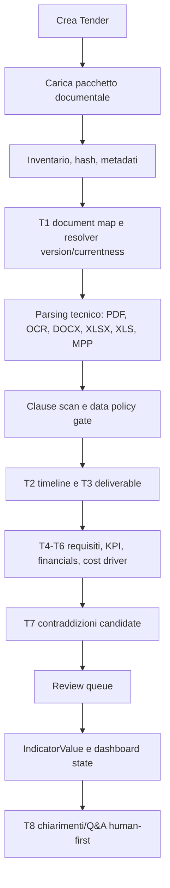

# TRAM V1 - Workflow ingestion-dashboard v0.1

Data: 2026-05-13  
Stato: decisione operativa iniziale  
Ambito: percorso end-to-end da pacchetto documentale a dashboard validabile

## Scopo

Questo documento definisce il workflow TRAM V1 da upload documenti a dashboard.

L’obiettivo è evitare una pipeline opaca. Ogni passaggio deve produrre artefatti verificabili, fonti, stati e review item quando necessario.

## Principio guida

TRAM non “legge PDF e compila dashboard” in un unico salto.

TRAM costruisce progressivamente:

1. inventario file;
2. document map;
3. versioning/currentness;
4. parsing tecnico;
5. estrazioni task T1-T8;
6. indicatori normalizzati;
7. review queue;
8. dashboard con stato di affidabilità.

## Flusso sintetico

## Stati principali del pacchetto

| Stato | Significato |
| --- | --- |
| `uploaded` | file caricati, non ancora inventariati |
| `inventoried` | hash, path, estensione e dimensioni disponibili |
| `mapped` | T1 document map prodotto |
| `parsed` | testo/tabelle/metadati tecnici estratti dove possibile |
| `policy_checked` | data policy e clause scan valutati almeno a livello iniziale |
| `extracted` | task T2-T8 prodotti o marcati non applicabili |
| `review_pending` | esistono item da validare |
| `dashboard_ready` | dashboard visibile con stato esplicito |
| `stale` | nuovi documenti o versioni cambiano dati già validati |
| `blocked` | policy, parsing, segreti, quota o dati sensibili impediscono un passaggio |

## Step 1 - Creazione Tender

Input:

- nome provvisorio;
- package slug;
- tipo pacchetto atteso se noto;
- utenti iniziali;
- policy iniziale.

Output:

- `Tender`;
- membership;
- `tender_policy_status=draft`;
- indicatori iniziali vuoti.

Ruoli:

- owner crea lo spazio;
- editor può preparare contenuti solo dopo invito.

## Step 2 - Upload pacchetto

Input:

- cartelle e file del pacchetto;
- eventuali integrazioni successive;
- eventuale nota utente.

Output:

- `DocumentPackage`;
- lista file originali;
- stato `uploaded`.

Regole:

- non rinominare file originali;
- preservare path relativo;
- calcolare hash;
- non loggare contenuto documentale completo.

## Step 3 - Inventario tecnico

Output minimi:

- path relativo;
- filename originale;
- estensione;
- dimensione;
- hash;
- page count se disponibile;
- lingua stimata se disponibile;
- mime type;
- flag OCR necessario;
- flag workbook/MPP/ZIP.

Indicatori alimentati:

- `documents.total_count`;
- `data_quality.parser_issues_count` se emergono errori tecnici.

## Step 4 - T1 document map

Responsabilità:

- parser/regole: filename, path, ID documento, versione, variante, famiglia, currentness candidate;
- AI L0: natura, ruolo e incertezze;
- normalizzatore: enum canonici;
- review: documenti sensibili, versioni ambigue, track changes, redline.

Output:

- `Document`;
- `DocumentVersion`;
- `document_family_key`;
- `currentness_rule_candidate`;
- `content_classes`;
- `privacy_level`;
- review item se necessario.

Indicatori alimentati:

- `tender.identity.*`;
- `documents.current_count`;
- `documents.changed_since_last_review_count`;
- `documents.version_conflict_count`;
- `ai.external_use.status`.

## Step 5 - Parsing tecnico

Parser previsti:

- PDF testuale;
- OCR per PDF scannerizzati;
- DOCX;
- XLSX/XLS;
- MPP tramite toolchain MPXJ;
- ZIP/GTFS come inventario strutturato;
- tabelle e allegati.

Output:

- testo indicizzato;
- tabelle normalizzate;
- righe MPP;
- estratti fonte;
- parser issues.

Regole:

- il parser non decide il significato finale;
- le celle economiche non vanno a provider esterni;
- ogni estratto deve mantenere riferimento a documento/versione/pagina/riga se disponibile.

## Step 6 - Clause scan e data policy gate

Scopo:

- capire se AI esterna è ammessa;
- individuare clausole dati/AI/confidentiality;
- bloccare L1/L2 se mancano basi.

Output:

- `AiGateDecision`;
- `tender_policy_status`;
- review item per clausole sensibili;
- stato UI.

Indicatori alimentati:

- `compliance.data_protection_ai_clause`;
- `ai.external_use.status`.

## Step 7 - T2 timeline

Input:

- date da istruzioni, MPP, timetable, disciplinari, PQQ;
- valori deterministici già estratti;
- source refs.

Output:

- `TimelineEvent`;
- indicatori deadline e durata;
- contraddizioni candidate su date divergenti;
- review item per milestone critiche.

Indicatori alimentati:

- `procurement.deadline.next_critical`;
- `procurement.deadline.questions`;
- `procurement.deadline.submission`;
- `contract.duration.base`;
- `contract.duration.extension_options`;
- `contract.mobilisation.start`;
- `contract.operation.start`;
- `contract.operation.end`;
- `contradictions.timeline_count`.

## Step 8 - T3 deliverable

Input:

- submission requirements;
- form e template;
- tabelle deliverable;
- criteri e allegati;
- source refs.

Output:

- `TenderDeliverable`;
- checklist;
- link a timeline;
- review item per deliverable economici, valutativi o sensibili.

Indicatori alimentati:

- `deliverables.total_count`;
- `deliverables.mandatory_count`;
- `deliverables.next_due`;
- `financial.model.required`.

## Step 9 - T4, T5 e T6

### T4

Produce requisiti O&M e KPI non finanziari.

### T5

Produce financials/payment solo con parser locale e review.

### T6

Classifica attività e obblighi che generano costi.

Indicatori alimentati:

- `requirements.mandatory_count`;
- `kpi.critical_count`;
- `financial.payment_mechanism.summary`;
- `financial.pricing_documents.present`;
- `financial.review_count`;
- `cost_drivers.top_count`;
- P1 operations, maintenance, workforce, compliance e cost driver.

## Step 10 - T7 contraddizioni candidate

Input:

- indicatori e source refs già prodotti;
- document versions;
- currentness resolver;
- valori alternativi.

Output:

- `ContradictionCandidate`;
- review item bloccante se rischio alto/critico;
- eventuale seed per T8.

Regola:

- T7 resta rules/review-first;
- AI non decide severity/action come verità applicativa in V1.

## Step 11 - Review queue

La review queue riceve:

- P0 senza fonte;
- valori P0 divergenti;
- dati L2;
- AI L1 su task critici;
- financials;
- contraddizioni;
- chiarimenti/Q&A;
- document currentness ambiguo.

Output:

- `ValidationAction`;
- indicatori corretti o confermati;
- stato dashboard aggiornato.

## Step 12 - Dashboard state

Regole iniziali:

| Condizione | Stato |
| --- | --- |
| nessuna estrazione sufficiente | `draft` |
| P0 parziali o non validati | `partially_validated` |
| P0 validati e nessun blocker | `validated_internal` |
| nuovi documenti dopo validazione | `stale_due_to_new_docs` |
| blocker critici aperti | `open_critical_issues` |

Indicatori alimentati:

- `dashboard.validation_state.overall`;
- `review.items.blocking_count`;
- `review.items.open_count`;
- `data_quality.source_coverage_ratio`.

## Step 13 - T8 chiarimenti/Q&A

T8 parte solo da:

- registri Q&A importati da portale o documentazione gara;
- contraddizione confermata o da chiarire;
- source refs minime;
- template di domanda/chiarimento;
- approvazione umana richiesta.

Regole:

- nessun invio automatico;
- chiarimenti L2 bloccati verso provider esterni;
- export solo con owner o reviewer delegato;
- ogni thread di chiarimento resta collegato a review item e fonte;
- Q&A e risposte pubblicate dall’ente sono trattati come documentazione di gara, non come commenti laterali;
- ogni risposta ricevuta dalla stazione appaltante può riaprire review e aggiornare dashboard state.
- un registro Q&A parziale non può chiudere analisi AI o currentness: deve mostrare `needs_review` o coverage incompleta;
- se il Q&A cita allegati non caricati, TRAM deve creare gap documentale e non dedurre il contenuto dell’allegato.

## Error handling

| Errore | Comportamento |
| --- | --- |
| file non leggibile | parser issue, review tecnica |
| OCR fallito | retry locale o marcatura manuale |
| MPP non parsabile | allegare file alla review tecnica |
| provider AI quota esaurita | job sospeso, nessun fallback paid |
| provider policy non verificata | blocco L1 |
| clausola AI/privacy restrittiva | local_only/human_only |
| dato P0 senza fonte | non consolidare |
| documenti nuovi | dashboard stale |

## Acceptance criteria workflow

Il workflow è pronto per diventare implementazione quando:

- ogni step produce un artefatto o uno stato tracciabile;
- ogni P0 del registro ha almeno uno step produttore;
- T1 distingue currentness da classificazione AI;
- T2 e T3 separano valori deterministici da normalizzazione AI;
- T5 usa parser/regole, AI su input ammessi e review;
- T7 non usa AI come decisore autonomo;
- T8 richiede sempre approvazione umana;
- ogni blocco policy è visibile in UI;
- ogni dashboard state è calcolabile da indicatori e review item.

## Debiti

- Definire naming tecnico delle tabelle quando inizierà il codice.
- Definire job queue e retry policy.
- Definire retention e cleanup per OCR/output intermedi.
- Definire fixture minime per ogni step.
- Definire smoke test end-to-end su un mini pacchetto sintetico, senza dati riservati.

## Prossimo passo consigliato

Usare questo workflow per dettagliare T2 timeline e T3 deliverable in termini operativi: input parser, campi deterministici, campi AI, review gate e output dashboard.
