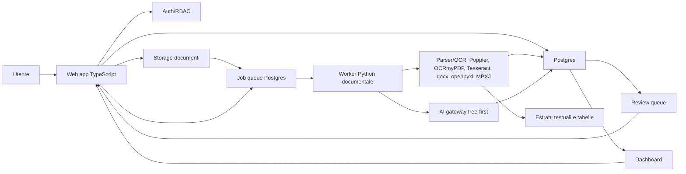

# TRAM V1 - Architettura MVP

Data: 2026-05-12
Stato: proposta tecnica da validare prima dello sviluppo
Ambito: MVP interno per 3 utenti iniziali

## Scopo

Questo documento propone la prima architettura MVP di TRAM.

Nota di correzione: una prima versione di questo documento era troppo orientata a Vercel, Supabase e OpenAI come scelta iniziale. Il vincolo ora è più preciso: TRAM V1 deve essere **free-first**, l’architettura non deve richiedere una riscrittura quando il prodotto scala, e l’AI iniziale deve essere gratuita per TRAM, pur potendo usare provider cloud free tier.

L’obiettivo è costruire una web app interna capace di:

- creare Tender condivisi;
- caricare e catalogare pacchetti documentali;
- processare PDF, DOCX, XLSX, XLS e MPP;
- generare estrazioni strutturate e citate;
- usare AI in modo controllato;
- gestire review queue e validazione critical-first;
- alimentare dashboard gara e dashboard aggregata;
- restare sostenibile per costi, sicurezza e complessità.

## Fonti tecniche consultate

Nota: le fonti elencate non equivalgono a scelte approvate. Alcune, come Vercel, Supabase e OpenAI, restano riferimenti utili o alternative possibili, ma la raccomandazione attuale è free-first e portabile.

- Next.js App Router, Server Components e Server Functions: https://nextjs.org/docs/app
- TanStack Start, Server Functions e full-stack routing: https://tanstack.com/start/docs/overview
- Supabase Auth SSR con Next.js: https://supabase.com/docs/guides/auth/server-side/nextjs
- Supabase Storage: https://supabase.com/docs/guides/storage
- Supabase Edge Functions: https://supabase.com/docs/guides/functions
- Supabase vector columns / pgvector: https://supabase.com/docs/guides/ai/vector-columns
- Vercel Cron Jobs: https://vercel.com/docs/cron-jobs/
- Vercel Functions / Fluid Compute: https://vercel.com/docs/functions/usage-and-pricing/
- OpenAI Structured Outputs: https://platform.openai.com/docs/guides/structured-outputs
- OpenAI File Search: https://platform.openai.com/docs/guides/tools-file-search/
- Gemini API pricing, billing, terms e abuse monitoring: https://ai.google.dev/gemini-api/docs/pricing
- Cloudflare Workers AI pricing e data usage: https://developers.cloudflare.com/workers-ai/platform/pricing/
- Groq rate limits e data policy: https://console.groq.com/docs/rate-limits
- Cerebras rate limits: https://inference-docs.cerebras.ai/support/rate-limits

## Decisione proposta

Per l’MVP consiglio una architettura **free-first, self-hostable e provider-agnostic**.

Stack proposto:

- **Frontend/app**: Next.js App Router, TypeScript, React, Tailwind, shadcn/ui o componenti equivalenti. L’app deve poter girare fuori da una piattaforma proprietaria.
- **Package manager**: npm.
- **Hosting app**: Oracle Cloud Free Tier Ampere A1 come target primario per MVP condiviso, se disponibilità e limiti Always Free lo consentono. Vercel free resta possibile per preview frontend solo se non introduce lock-in architetturale.
- **Database**: Postgres standard, con schema non dipendente da funzionalità proprietarie. Può partire self-hosted o su free tier gestito, ma il modello dati resta portabile.
- **Auth e ruoli**: auth applicativa o provider compatibile con Postgres/RBAC. Supabase Auth resta alternativa possibile, non vincolo architetturale.
- **Storage documentale**: OCI Object Storage Always Free come target primario per documenti caricati nel MVP condiviso; filesystem locale solo per sviluppo/fixture; storage adapter sostituibile obbligatorio.
- **Pipeline documentale**: worker Python separato su VPS o ambiente controllato. Il Mac dell’utente può servire per sviluppo, non come runtime AI di prodotto.
- **AI**: AI gateway interno, gratuito, provider-agnostic e governato da registro chiamate/gate privacy. Provider candidati: Gemini, Mistral, Cloudflare Workers AI, Groq, Cerebras, OpenRouter e fallback VPS/self-hosted.
- **Normalizzatori AI**: runtime canonico TypeScript lato app/API/AI gateway; worker Python limitato a parsing, OCR, extraction e candidate generation.
- **Embeddings/search**: Postgres/pgvector o vector store solo dopo benchmark. Non blocca la prima MVP.
- **Jobs**: tabella `jobs` in Postgres + worker polling; cron leggero solo per trigger e riprese job.

## Perché questa architettura

### App TypeScript containerizzabile

TRAM deve nascere come web app document-centric e dashboard interna, ma la scelta framework non deve imporre il provider di hosting.

Next.js è maturo e molto documentato per dashboard, routing e rendering server-side. TanStack Start resta una alternativa seria, ma non viene scelto per il MVP perché la coerenza con altri progetti non è un vincolo TRAM.

Decisione operativa del 2026-05-13:

- usare Next.js App Router come framework MVP;
- usare npm come package manager;
- usare React, TypeScript, Tailwind e shadcn/ui o componenti equivalenti come UI stack;
- mantenere l’app containerizzabile e deployabile anche fuori da Vercel.

Motivo: TRAM ha più rischio su documenti, storage, worker, permessi, audit e AI gate che sul routing. Next.js è la scelta più matura e prudente per questo profilo. La coerenza con Pratix non è un vincolo per TRAM.

### Postgres standard per database, auth e audit

TRAM ha bisogno subito di:

- Postgres relazionale;
- ruoli e permessi;
- eventuale RLS o controllo permessi applicativo;
- audit log;
- possibilità futura di pgvector;
- costi iniziali nulli o bassi;
- portabilità.

Supabase resta possibile come opzione gestita/free tier, ma lo schema non deve dipendere da Supabase in modo irreversibile.

Decisione operativa del 2026-05-13:

- sviluppare contro Postgres standard;
- usare Postgres locale in Docker per sviluppo, benchmark tecnici e prove schema;
- usare una VPS/free tier o un Postgres gestito compatibile per l’MVP condiviso con i primi tre utenti;
- non scegliere Supabase come default automatico;
- tenere Supabase come opzione se accelera Auth, Storage o gestione operativa senza introdurre lock-in sostanziale;
- non usare feature Supabase-specifiche come fondamento non portabile della V1, salvo decisione esplicita documentata.

### Worker Python separato per i documenti

Il parsing documentale non va messo dentro funzioni serverless web.

Motivi:

- OCR, PDF rendering e MPP possono essere lenti;
- Poppler, Tesseract, MPXJ e Java sono dipendenze pesanti;
- i job devono poter fallire e ripartire;
- serve controllo su memoria, file temporanei e log;
- il costo e il timeout sarebbero più difficili da gestire in una funzione web.

Quindi: app web leggera, worker documentale dedicato.

## Architettura logica

## Componenti

### 1. Web app

Responsabilità:

- login;
- Tender;
- upload o registrazione pacchetti;
- document map;
- dashboard gara;
- dashboard aggregata;
- review queue;
- apertura fonti;
- validazione e audit;
- export base.

Non deve occuparsi di:

- OCR pesante;
- parsing massivo;
- confronto semantico lungo;
- job AI lunghi.

### 2. Postgres

Responsabilità:

- data model evidence-first;
- utenti e ruoli;
- stato documenti;
- estrazioni;
- fonti;
- indicatori;
- review item;
- audit;
- job queue.

Tabelle iniziali candidate:

- `tenders`;
- `document_packages`;
- `documents`;
- `document_versions`;
- `extraction_runs`;
- `extractions`;
- `source_references`;
- `indicator_values`;
- `review_items`;
- `validation_actions`;
- `dashboard_validation_states`;
- `clarification_drafts`;
- `ai_gate_decisions`;
- `ai_calls`;
- `ai_provider_policy_snapshots`;
- `ai_budget_policies`;
- `jobs`;
- `tender_members`.

### 3. Storage documentale

Opzioni:

| Opzione | Pro | Contro | Uso consigliato |
| --- | --- | --- | --- |
| Storage su VPS | Semplice, gratuito se rientra nel free tier | Backup e scalabilità da curare | Fallback temporaneo se OCI Object Storage blocca il prototipo |
| MinIO o S3-compatible | Scalabile e più portabile | Più setup | Buona base se vogliamo evitare riscritture |
| OCI Object Storage o equivalente | Integrabile con VPS/free tier | Policy e limiti da monitorare | Target MVP condiviso scelto |
| Supabase Storage | Semplice e integrato | Più legato a Supabase | Alternativa se scegliamo Supabase free |

Decisione operativa del 2026-05-13:

- runtime MVP condiviso target: Oracle Cloud Free Tier Ampere A1;
- storage documentale MVP condiviso target: OCI Object Storage Always Free;
- sviluppo locale: filesystem locale solo per fixture, prototipo e mini pacchetto sintetico;
- fallback: filesystem/block volume su VPS se OCI Object Storage blocca il prototipo;
- storage adapter obbligatorio, con interfaccia sostituibile filesystem/Object Storage;
- nessun documento reale va caricato finché bucket, IAM, retention, accessi e backup non sono documentati.

Per la fase attuale resta modalità ibrida:

- pacchetti benchmark locali in `data/packages`;
- metadati e risultati in database;
- fixture e sviluppo locale senza dati reali;
- OCI Object Storage come target per documenti del MVP condiviso, dopo policy dati e consenso.

Regole confermate:

- separare database e document storage;
- non salvare documenti reali in Postgres salvo metadati, hash, stati e riferimenti;
- preferire storage astratto e sostituibile;
- usare OCI SDK/CLI o compatibilità S3 solo dopo conferma tecnica del bucket;
- non introdurre MinIO, R2 o Supabase Storage salvo blocco pratico su OCI.

### 4. Worker documentale Python

Responsabilità:

- leggere job pending;
- scaricare o leggere file;
- estrarre testo;
- OCR quando serve;
- estrarre tabelle;
- leggere Excel;
- leggere MPP;
- creare chunks;
- salvare `Extraction`, `SourceReference`, `IndicatorValue`;
- chiamare AI quando previsto;
- aggiornare stato job.

Toolchain già validata localmente:

- Python 3.12;
- Poppler;
- Tesseract;
- OCRmyPDF;
- qpdf;
- Ghostscript;
- OpenJDK;
- MPXJ;
- `pypdf`, `pdfplumber`, `pymupdf`;
- `python-docx`;
- `openpyxl`, `pandas`, `xlrd`;
- `mpxj`, `jpype1`.

### 5. Moduli AI-assisted

Responsabilità candidate:

- classificazione documento;
- estrazione requisiti;
- estrazione KPI;
- sintesi financial/payment;
- detection contraddizioni;
- normalizzazione indicatori;
- chiarimenti/Q&A, inclusi thread domanda-risposta e bozze approvate manualmente.

Regole:

- output sempre strutturato con schema;
- fonte obbligatoria;
- confidenza obbligatoria;
- nessuna domanda o chiarimento inviato automaticamente;
- nessun dato critico consolidato senza review.

Il layer AI deve essere astratto. Per la V1 non scegliamo un singolo modello “ufficiale”: scegliamo un gateway che può chiamare provider gratuiti e salvare sempre provider, modello, prompt version, input hash, output hash, confidenza, fonti e consumo.

Il gateway deve usare il registro e i gate documentati in:

- `/Users/Matteo/Documents/TRAM/docs/planning/tram-v1-ai-call-registry-and-gates-v0-1.md`
- `/Users/Matteo/Documents/TRAM/docs/planning/tram-v1-ai-document-class-provider-matrix-v0-1.md`
- `/Users/Matteo/Documents/TRAM/docs/planning/tram-v1-ai-chunk-minimization-redaction-policy-v0-1.md`
- `/Users/Matteo/Documents/TRAM/docs/decisions/tram-adr-001-normalizer-runtime-placement-v0-1.md`

In pratica:

- `ExtractionRun` descrive la run di pipeline;
- `AiGateDecision` decide se la chiamata AI è ammessa;
- `AiCall` registra provider, modello, input/output hash, usage, quota, costo e stato;
- la matrice classi documentali decide il privacy level effettivo e i provider ammessi;
- la policy di minimizzazione decide quali campi possono entrare nel prompt;
- il normalizzatore TypeScript canonico applica schema, alias, campi rule-owned, warning, review gate e stati finali;
- l’output AI alimenta `Extraction`, `IndicatorValue` e `ReviewItem`, ma non bypassa la validazione umana.

La strategia AI gratuita V1 è documentata in:

- `/Users/Matteo/Documents/TRAM/docs/planning/tram-v1-free-ai-strategy.md`

File Search o strumenti equivalenti possono aiutare retrieval e test, ma nella prima MVP non devono sostituire il nostro layer evidence-first, perché TRAM deve conservare fonti, stati e audit nel proprio database.

## Pipeline MVP

### Fase 1 - Ingestion

1. Utente crea Tender.
2. Utente registra o carica pacchetto.
3. TRAM crea `DocumentPackage`, `Document`, `DocumentVersion`.
4. TRAM calcola hash, formato, dimensione, metadati.
5. TRAM crea job `parse_document`.

### Fase 2 - Parsing

1. Worker legge job.
2. Worker estrae testo e tabelle.
3. Worker crea `SourceReference`.
4. Worker salva file testuali intermedi, se necessario.
5. Worker aggiorna stato `text_extraction_status`.

### Fase 3 - Estrattori base

1. Estrattori rule-based trovano date, versioni, document ID, headings, tabelle.
2. Parser Excel/MPP produce timeline e price structure.
3. TRAM crea prime `Extraction`.

### Fase 4 - AI-assisted extraction

1. AI lavora su chunks e schemi specifici.
2. Produce output JSON validato.
3. Ogni output cita fonti.
4. TRAM salva `Extraction` e `IndicatorValue`.

### Fase 5 - Reconciliation

1. TRAM confronta indicatori simili da fonti diverse.
2. Regole trovano mismatch numerici o date divergenti.
3. AI può proporre contraddizioni semantiche.
4. TRAM crea `ContradictionCandidate` e `ReviewItem`.

### Fase 6 - Review

1. Utente apre review queue.
2. Conferma, corregge, contesta o chiede chiarimenti.
3. TRAM registra `ValidationAction`.
4. Dashboard aggiorna stato.

### Fase 7 - Dashboard

1. Dashboard mostra dati P0.
2. Ogni card indica fonte e stato.
3. Dashboard segnala blocker e criticità aperte.
4. Dashboard aggregata mostra stato dei vari Tender.

## Deployment MVP

### Fase locale

Uso:

- sviluppo;
- analisi pacchetti Copenhagen e Luas;
- test parser/OCR;
- preparazione benchmark AI.

Componenti:

- app in locale;
- Postgres locale in Docker come default dev;
- worker Python locale;
- documenti in `data/packages`.

Nota: l’inference AI applicativa non deve dipendere dal Mac dell’utente. In locale possiamo testare chiamate ai provider o prototipi, ma il runtime condiviso V1 deve stare su VPS o provider.

### Fase interna cloud leggera

Uso:

- accesso dei primi tre utenti;
- validazione workflow;
- dashboard condivisa.

Componenti:

- Oracle Cloud Free Tier Ampere A1 come ambiente principale, se disponibile e stabile;
- web app containerizzata;
- Postgres standard;
- OCI Object Storage Always Free per documenti caricati;
- worker Python sulla stessa VPS o su worker separato;
- AI gateway verso provider gratuiti o free tier;
- documenti su storage scelto secondo policy.

### Fase robusta

Uso:

- più gare;
- più utenti;
- documenti grandi;
- processing ricorrente.

Componenti:

- web app stabile;
- Postgres con backup e RLS;
- storage EU o policy-defined;
- worker scalabile;
- job queue più robusta;
- osservabilità;
- cost controls AI.

## Sicurezza e dati

Decisioni minime:

- niente documenti reali in Git;
- storage separato da repo;
- chiave `ssh-key-tram.key` esclusa e trattata come segreto;
- RLS su ogni Tender;
- ruoli owner/editor/reviewer/viewer;
- audit log per validazioni e modifiche;
- AI disattivabile per pacchetto o documento;
- policy esplicita per invio documenti o estratti a provider AI esterni;
- retention e cancellazione da definire prima di uso esteso.

## Costi MVP

Obiettivo: partire a costo zero o quasi zero, senza bloccare la progettazione.

Voci costo:

- Oracle Cloud Free Tier Ampere A1: costo atteso zero entro limiti Always Free, con rischio disponibilità/capacity, limiti risorse e manutenzione;
- Vercel/Supabase free tier: possibili alternative o appoggio, ma non devono creare lock-in non voluto;
- Postgres locale: costo zero per sviluppo, non sufficiente per uso condiviso;
- Postgres su VPS/free tier: costo potenziale zero, ma richiede backup, aggiornamenti e monitoraggio;
- Supabase free: costo iniziale zero, ma va valutato contro lock-in e limiti piano;
- OCI Object Storage Always Free: costo atteso zero entro limiti Always Free, con limiti di spazio/API request da verificare e monitorare;
- AI: gratuita in V1 tramite free tier, crediti o cap pari a zero/minimo;
- Gemini: può richiedere carta o billing per accesso, cap o regime privacy; se usato, va impostato con budget pari a zero o minimo e senza auto-reload non approvato;
- worker: su VPS/free tier se serve continuità;
- OCR: costo compute, non API;
- storage documenti: OCI Object Storage per MVP condiviso; filesystem locale solo per sviluppo/fixture.

Regole di controllo:

- stimare costo per pacchetto;
- salvare token, unità consumo, quota e costo stimato per ogni `AiCall`;
- evitare reprocessing completo se cambia solo un documento;
- usare AI solo su chunks rilevanti;
- separare estrazioni P0 da analisi profonde;
- introdurre caching delle estrazioni;
- sospendere il job se finisce la quota gratuita, senza passaggio automatico a pagamento.

## Alternative considerate

### Tutto serverless

Scartata per MVP documentale.

Motivo: OCR, PDF, MPP e parsing pesante non sono ideali per funzioni brevi e stateless.

### Tutto locale

Valida per benchmark documentale e parsing, non per prodotto condiviso.

Motivo: tre utenti e spazi condivisi richiedono web app e database condivisi. Inoltre l’AI applicativa non deve girare sul Mac dell’utente.

### AI/File Search come backend principale

Non consigliata per V1.

Motivo: TRAM deve possedere data model, stati, review, fonti, audit e dashboard. File Search può aiutare retrieval, ma non deve sostituire il sistema evidence-first.

### TanStack Start invece di Next.js

Alternativa valida.

Motivo per non sceglierla ora come decisione chiusa: TRAM ha più rischio su documenti, storage, auth, processing e AI governance che su routing type-safe. Next.js resta maturo, TanStack Start resta coerente con altri progetti. La decisione finale va presa quando fissiamo lo stack app.

### Vercel + Supabase gestito come default

Alternativa valida per velocità di setup, ma non più raccomandazione primaria.

Motivo: il vincolo free-first e la richiesta di architettura scalabile senza riscrittura rendono preferibile progettare prima una base self-hostable e portabile. Vercel e Supabase possono ancora essere usati se rispettano questo vincolo.

## Rischi

| Rischio | Impatto | Mitigazione |
| --- | --- | --- |
| Documenti troppo grandi | Job lenti o costosi | Worker separato, chunking, queue |
| AI costosa | Costo per gara alto | Free-first, provider gateway, hard cap, nessun fallback paid automatico |
| Dati sensibili su cloud | Rischio compliance | Modalità locale/ibrida e policy AI per spazio |
| Troppe estrazioni | Review ingestibile | Critical-first review queue |
| Parsing imperfetto | Dati sbagliati | SourceReference, confidence, validation |
| Versioning complesso | Dashboard obsoleta | DocumentVersion e blocker su current status |
| Vendor lock-in AI | Rischio futuro | Interfaccia AI modulare e output schema-based |

## Decisioni da validare

1. Confermare Postgres standard come base dati portabile; default dev locale in Docker, target MVP condiviso su Oracle Ampere A1 salvo blocchi di capacità/stabilità.
2. Decidere dove far girare il worker dopo la fase locale.
3. Trasformare il registro AI e i gate privacy/costo in schema applicativo.
4. Verificare setup Gemini con carta/billing, budget pari a zero o minimo, e regime privacy per EEA.
5. Decidere se File Search o strumenti equivalenti entrano nella V1 o restano esperimento controllato.

Decisione già presa:

- framework MVP: Next.js App Router;
- package manager: npm;
- UI stack: React, TypeScript, Tailwind, shadcn/ui o componenti equivalenti;
- runtime MVP condiviso target: Oracle Cloud Free Tier Ampere A1;
- storage documentale MVP condiviso target: OCI Object Storage Always Free;
- dev locale storage: filesystem locale solo per fixture/sviluppo;
- fallback storage: filesystem/block volume su VPS se OCI Object Storage blocca il prototipo;
- policy `.gitignore`/segreti definita in `/Users/Matteo/Documents/TRAM/docs/planning/tram-v1-gitignore-and-secrets-policy-v0-1.md`;
- runbook OCI minimo definito in `/Users/Matteo/Documents/TRAM/docs/runbooks/tram-v1-oci-mvp-runtime-and-storage-runbook-v0-1.md`;
- la sede runtime dei normalizzatori AI è definita nell’ADR `/Users/Matteo/Documents/TRAM/docs/decisions/tram-adr-001-normalizer-runtime-placement-v0-1.md`: TypeScript lato app/API/AI gateway come runtime canonico, config condiviso, worker Python non canonico per la normalizzazione.

## Raccomandazione attuale

Partire con:

- app Next.js App Router TypeScript containerizzabile;
- npm come package manager;
- React, Tailwind e shadcn/ui o componenti equivalenti;
- Postgres standard per dati e utenti, con sviluppo locale in Docker;
- Oracle Ampere A1 come target runtime condiviso;
- OCI Object Storage Always Free come target storage documentale condiviso;
- filesystem locale solo per sviluppo/fixture e mini pacchetto sintetico;
- worker Python su ambiente controllato;
- AI gateway gratuito e provider-agnostic;
- normalizzatori AI canonici in TypeScript lato app/API/AI gateway;
- Gemini come candidato principale T1 L0 e Mistral come secondo provider, con registro chiamate AI e gate privacy/costo;
- Cloudflare, Groq, Cerebras e OpenRouter solo come fallback o test mirati finché non passano benchmark e policy;
- review queue critical-first;
- nessun invio automatico di domande o chiarimenti;
- nessun apprendimento cross-gara non revisionato.

Questa architettura è abbastanza semplice per partire, ma non blocca una futura evoluzione verso hosting più robusto, storage cloud, worker scalabile, vector search e dashboard multi-gara più avanzata.

## Prossimo passo consigliato

Avviare lo Slice 0 solo dopo approvazione esplicita: scaffold Next.js App Router, npm, `.gitignore`, `.env.example`, fixture JSON sintetiche, interfaccia storage e driver filesystem locale senza dati reali.
